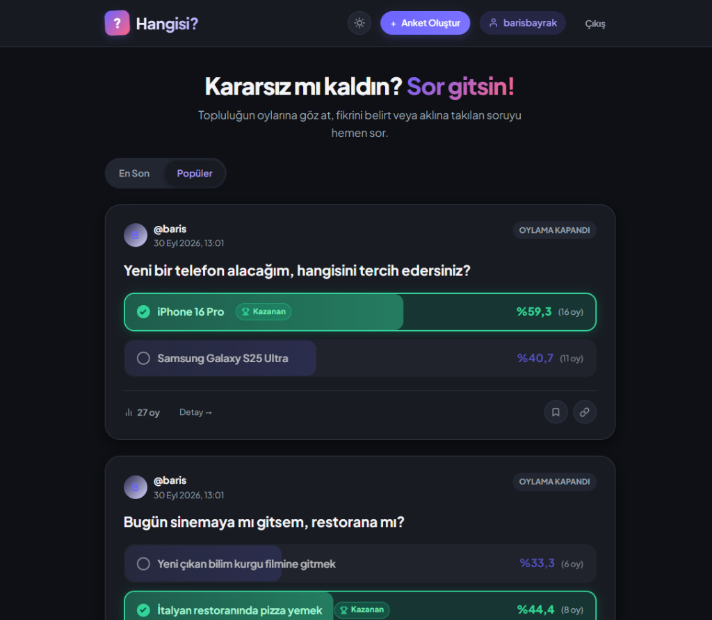

# Hangisi?

Kullanıcıların kararsız kaldığı konularda 2-5 seçenekli anketler oluşturup danışabileceği modern ve dinamik sosyal anket platformu.



## Özellikler

- Açık (Light) ve Koyu (Dark) mod desteği.
- Modern, duyarlı (responsive) kart tabanlı arayüz ve anlık canlı geri sayım sayaçları.
- Kapanan anketlerde kazanan seçeneğin kupa rozeti ile otomatik vurgulanması.
- Anketleri kaydetme (Bookmarks) özelliği.
- Üye ve misafir oylama desteği.
- Misafirler için LocalStorage ve Session, üyeler için veritabanı kısıtlaması ile mükerrer oy engeli.
- Fetch API ile sayfa yenilenmeden dinamik oy verme ve animasyonlu sonuç çubukları.
- Anket oluştururken en az 2, en fazla 5 dinamik seçenek yönetimi.
- Tekil anket detay sayfası ve bağlantı kopyalama.
- CustomUser (AbstractUser) ile e-posta ve kullanıcı adı zorunluluğu.
- Supabase PostgreSQL desteği.
- Vercel Native Django dağıtım desteği ve WhiteNoise statik dosya yönetimi.

## Klasör Yapısı

```text
Hangisi/
├── backend/
│   ├── hangisi_core/
│   ├── users/
│   └── polls/
├── frontend/
│   ├── templates/
│   └── static/
│       ├── css/
│       └── js/
├── images/
│   └── preview.png
├── manage.py
├── requirements.txt
└── .env
```

## Kurulum ve Çalıştırma

1. Sanal ortamı aktif edin:

   ```powershell
   .\.venv\Scripts\Activate.ps1
   ```

2. Bağımlılıkları kurun:

   ```bash
   pip install -r requirements.txt
   ```

3. Veritabanı tablolarını oluşturun:

   ```bash
   python manage.py migrate
   ```

4. Sunucuyu başlatın:
   ```bash
   python manage.py runserver
   ```
   Uygulama: `http://127.0.0.1:8000/`

## Veritabanı (Supabase)

Proje `.env` dosyasında `DATABASE_URL` tanımlı olduğunda doğrudan PostgreSQL veritabanına bağlanır, tanımlı değilse yerel SQLite kullanır.

## Dağıtım (Vercel)

Proje Vercel üzerinde Native Django sunucusuz mimarisi ve WhiteNoise statik dosya optimizasyonu ile canlıda çalışmaktadır.

---

## 🌐 Canlı Demo

Uygulamayı hemen test etmek, anket oluşturup oy kullanmak için:

👉 **[https://hangisisocial-polls.vercel.app](https://hangisisocial-polls.vercel.app)**
